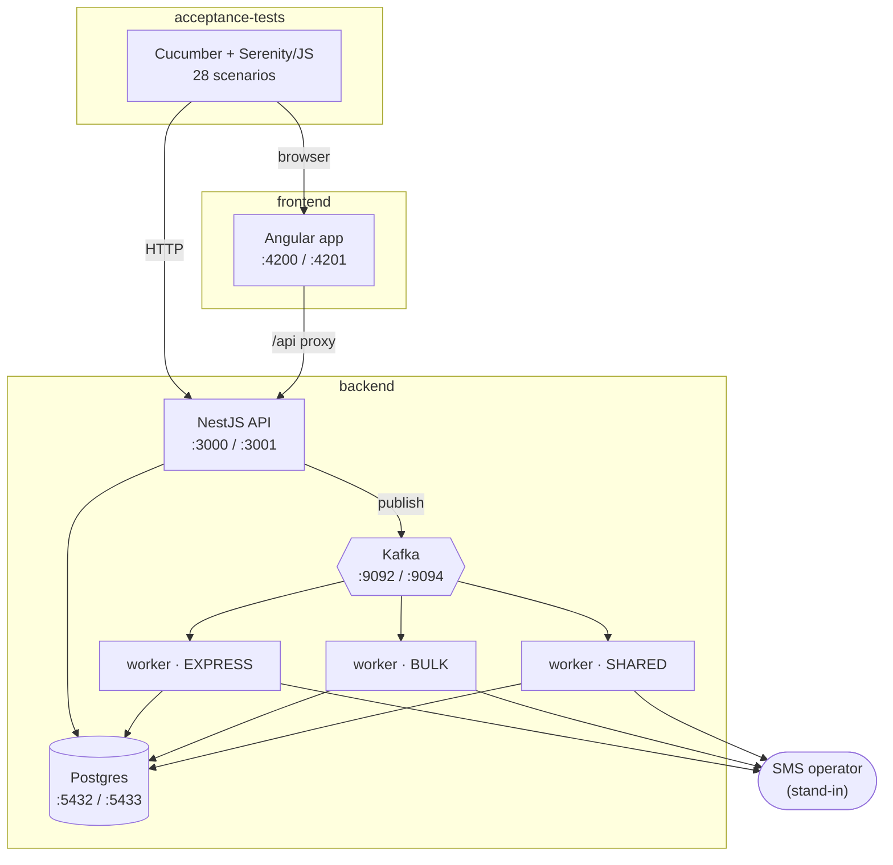
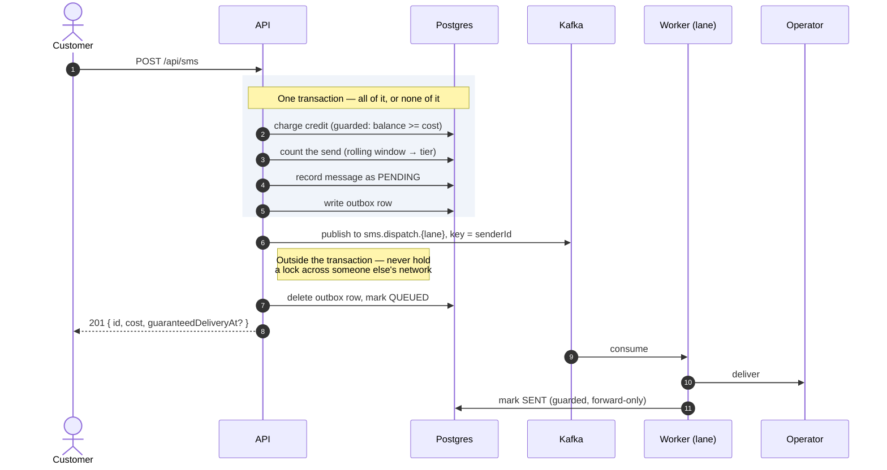

# SMS Gateway

An SMS gateway for businesses. A customer signs up, tops up their account credit, and sends messages
to any number — either as standard traffic or as **express**, which carries a guaranteed delivery
time to the operator for things like one-time passwords. They can read a report of everything that
actually went out.

The system is built for very uneven load: tens of thousands of businesses, some sending a handful of
messages a day and some sending millions. Keeping one customer's campaign from delaying another's
confirmation message is the central design problem, and most of the interesting decisions here are
about that.

Built for the ArvanCloud software developer challenge. **[What the brief asked for, and where each
requirement lives →](docs/requirements.md)**

[**Living documentation**](https://ariana126.github.io/arvancloud-software-developer-challenge-sms-gateway/)
· [**Architecture decisions**](docs/adr/README.md) · [**Requirements map**](docs/requirements.md)

---

## Quickstart

Everything runs in Docker. You need **Docker**, **Docker Compose** and **make** — no Node, no
database, no secrets, no `.env` to fill in. (`curl` and `jq` are handy for the API steps below, but
Swagger UI does the same job in a browser.)

```bash
git clone git@github.com:ariana126/arvancloud-software-developer-challenge-sms-gateway.git
cd arvancloud-software-developer-challenge-sms-gateway
make up        # builds and starts everything, waits until healthy
make migrate   # apply database migrations
```

**Step 1 — sign up**, in the browser at **<http://localhost:4200/sign-up>**. Any email, and a
password of twelve characters or more. You land on your profile, signed in.

**Step 2 — top up your credit.** One SMS costs 1,000 rials. This has no screen, so use **Swagger UI
at <http://localhost:3000/api-docs>** or the snippet below (which needs `curl` and `jq`):

```bash
API=http://localhost:3000/api
TOKEN=$(curl -s $API/auth/login -H 'Content-Type: application/json' \
  -d '{"email":"you@example.com","password":"your-password"}' | jq -r .accessToken)

curl -s $API/credit/increase -H "Authorization: Bearer $TOKEN" \
  -H 'Content-Type: application/json' -d '{"amount":50000}'   # 50 messages' worth
```

**Step 3 — send a message**, back in the browser at **<http://localhost:4200/send-sms>**. Choose
**express** and the response carries `guaranteedDeliveryAt` — the time by which delivery to the
operator is guaranteed, five minutes out. Send a few. Try one more than your credit covers and it is
refused with `402` rather than partially accepted.

**Step 4 — read your report**, which lists what actually went out rather than what was merely
accepted:

```bash
curl -s $API/sms -H "Authorization: Bearer $TOKEN" | jq        # your sent messages
curl -s $API/sms/traffic -H "Authorization: Bearer $TOKEN" | jq # how your send rate is classified
```

Steps 2 and 4 are API-only: there is no screen for topping up or for the report. That is a real limit
of the UI, and it is [set out in the requirements
map](docs/requirements.md#what-has-a-screen-and-what-does-not).

```bash
make run-acceptance-tests   # 28 black-box scenarios, over HTTP and through a real browser
make run-unit-tests         # domain rules, no database, no framework
make run-guardrails         # every check CI enforces, cheapest first
make down                   # stop everything
```

`make help` lists every target. `make up` starts **both** a development stack and a test stack, on
separate ports, so the acceptance suite can never touch the data you are looking at.

---

## What it does

| Capability | API | Screen | Proved by |
| --- | --- | --- | --- |
| Sign up, log in, view profile | `POST /api/users` · `POST /api/auth/login` · `GET /api/users/me` | `/sign-up` `/login` `/profile` | `registration/sign-up.feature` |
| Send an SMS | `POST /api/sms` | `/send-sms` | `sms-sending/send-sms.feature` |
| Send an **express** SMS with a delivery guarantee | `POST /api/sms` | `/send-sms` | `sms-sending/send-express-sms.feature` |
| Top up account credit | `POST /api/credit/increase` · `GET /api/credit` | — | `credit/increase-credit.feature` |
| Read a report of sent messages | `GET /api/sms` | — | `reporting/view-sent-sms-report.feature` |
| See how your send rate is classified | `GET /api/sms/traffic` | — | `sms-sending/high-volume-senders.feature` |
| Look up the price of one SMS | `GET /api/sms/pricing` | — | — |

**The UI covers sign-up, log-in, profile and sending.** Topping up credit and reading the report are
API-only — every requirement in the brief is met, but four of the seven capabilities have no screen.
That is a real limit and it is stated here rather than left to be discovered.

Every row's proof is a scenario written in business language that drives the system from outside — no
imports, no database access. [The requirements map](docs/requirements.md) ties each one back to the
line of the brief it satisfies, and is explicit about the one requirement that is designed for but
not demonstrated.

---

## How it fits together

Three independent projects. Each has its own build, its own image, its own Compose stack and its own
documentation; none imports another.



The arrows only ever point one way: the acceptance suite drives the other two through the API a
client would call and the page a person would look at, and knows nothing else about either. The
frontend depends on the backend's *contract* — its own copy of the OpenAPI spec, checked for drift by
CI — rather than on the backend project.

**Three workers, one per lane, is the whole mechanism** behind the two promises this system makes: an
express message is not stuck behind a marketing blast, and a large customer's campaign does not delay
a small customer's confirmation. Each lane is its own topic, its own consumer group and its own
process.

### The life of a send



Two things this diagram exists to show:

**The broker call is outside the transaction.** Producing to Kafka from inside the handler would be a
dual write across two systems with no transaction spanning them — the charge commits and the publish
fails, or the reverse. The outbox row is what makes the broker correct.
→ [ADR 9](docs/adr/0009-transactional-outbox-for-dispatch.md)

**Two processes race on the message row.** The API marks it `QUEUED`; a worker on the far side of the
broker marks it `SENT`, and the worker frequently wins. Both writes are guarded forward transitions.
Before they were, forty concurrent sends left 39 of 45 delivered messages permanently reported as
undelivered. → [ADR 12](docs/adr/0012-queued-state-with-forward-only-transitions.md)

---

## Why it is shaped this way

[**`docs/adr/`**](docs/adr/README.md) holds seventeen Architecture Decision Records — what was
decided, which alternatives were rejected, what it cost, and which `make` target enforces it. Each is
a page or two.

The ones worth reading first:

- [Three isolated Kafka dispatch lanes](docs/adr/0010-three-kafka-dispatch-lanes.md) — the answer to
  uneven customer load, and why keying by sender is necessary but not sufficient.
- [Guarded SQL deltas, never read-modify-write](docs/adr/0008-guarded-sql-deltas-for-concurrent-state.md)
  — how a balance is spent to exactly zero and never past it.
- [Dispatch through a transactional outbox](docs/adr/0009-transactional-outbox-for-dispatch.md).

**Two of the seventeen record work that was deliberately *not* done** —
[separating the report's read load from the write database](docs/adr/0016-serve-the-report-from-the-write-database.md)
and [a circuit breaker around the operator](docs/adr/0017-no-circuit-breaker-around-the-sms-provider.md)
— each with an explicit trigger for revisiting it. An undocumented gap looks like an oversight; a
dated deferral with a named trigger is a decision.

---

## How it is validated

Software has two values, and both need continuous validation:

> Software has two values: **functionality** and **structure**. What makes software *soft* —
> adaptable and changeable — is its structure, not its functionality.
>
> — *Clean Architecture*, Robert C. Martin

**Functionally.** `make run-unit-tests` covers domain logic in isolation — no database, no framework.
`make run-acceptance-tests` runs 28 black-box BDD scenarios written in business language, driving the
API over HTTP and the UI through a real browser exactly as a client would. They know nothing about
the implementation, so they keep validating behaviour through a rewrite of it.

That suite doubles as documentation. Every run renders
[**living documentation**](https://ariana126.github.io/arvancloud-software-developer-challenge-sms-gateway/)
— a browsable site generated from the scenarios that actually ran, published on every push to `main`.
It cannot drift from the code, because it *is* the test results.

**Structurally**, because structure erodes silently and no human review catches it reliably. Eight
checks, each its own CI job so a violation names itself:

| Check | What it holds |
| --- | --- |
| `make format` · `make lint` | Style and code quality |
| `make lint-architecture` | The DDD + CQRS layer boundaries, as machine-checkable rules — the domain may not import the framework, the application may not reach into infrastructure, modules may not import each other |
| `make lint-swagger` | The committed API spec still matches the code |
| `make lint-api-contract` | The frontend's copy of that spec has not drifted |
| `make lint-accessibility` | Every route passes axe's WCAG A/AA rules in a real browser |
| `make run-unit-tests` · `make run-acceptance-tests` | The two functional layers above |

`make run-guardrails` runs all eight locally, cheapest first, and answers "will CI pass?".
`make fix-violations` applies every fix they would demand.

---

## Where everything is

| | |
| --- | --- |
| [Requirements map](docs/requirements.md) | The brief, quoted, mapped to code and to the test that proves it |
| [Architecture decisions](docs/adr/README.md) | Seventeen ADRs — the *why* |
| [Living documentation](https://ariana126.github.io/arvancloud-software-developer-challenge-sms-gateway/) | The scenarios that ran, as a browsable site |
| Swagger UI | `http://localhost:3000/api-docs` once running |
| [`backend/README.md`](backend/README.md) | Tech stack, project structure, request flow, error handling |
| [`frontend/README.md`](frontend/README.md) | Pages, commands, Angular CLI usage |
| [`acceptance-tests/README.md`](acceptance-tests/README.md) | The BDD suite and how it is organised |
| `CLAUDE.md` files | Working guidance for AI agents in each project — commands, conventions and traps |

---

## Built with

This repository is an instance of two of my own projects, and it is the best evidence either of them
has.

**[Nmk](https://github.com/ariana126/nmk)** — a starter template for building reliable, scalable and
maintainable applications fast, by delegating implementation to AI agents while keeping humans in the
loop for validation and review. The validation layer above *is* Nmk: the per-project Makefiles, the
one-CI-job-per-check shape, the agent definitions in `.claude/agents/`, and the principle that a
check must run identically on a laptop and in CI.

**[Flfl](https://github.com/ariana126/flfl)** — software engineering books and guidelines packaged as
Claude Code skills. Two plugins: `bookshelf`, a skill per book, and `handbook`, cross-source
guidelines for common decisions. It is not decoration here — you can see where it landed:

- The ADR template comes from *Fundamentals of Software Architecture* ch. 21, cited in
  [ADR 1](docs/adr/0001-record-architecture-decisions-in-adrs.md).
- The blended UI/API split in the acceptance suite follows *BDD in Action* ch. 10, with a stated
  reason per scenario in [`acceptance-tests/CLAUDE.md`](acceptance-tests/CLAUDE.md).
- The two-values quote above is *Clean Architecture*, which is where this section's framing came from.
- `backend/CLAUDE.md` names `handbook`'s architecture, OOP and testing guidelines as the authority on
  the stack's design.

---

## License

[MIT](LICENSE)
